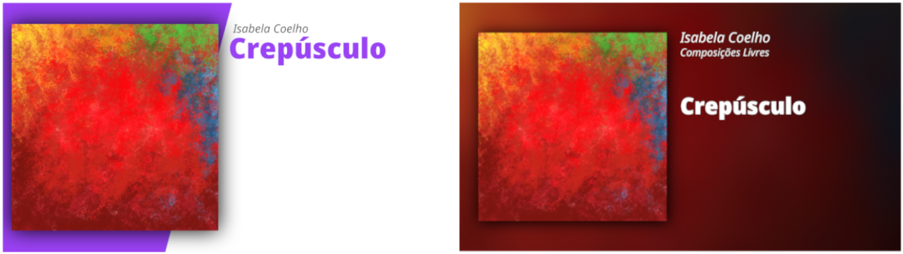

# Music2Video
Takes audio and cover art and exports a video to upload online

## Dependancies
- [MoviePy](https://github.com/Zulko/moviepy), but it seems as if you'll need to install 1.0.0 as 1.0.1 spits out errors.
- [PIL](https://pillow.readthedocs.io/en/stable/), IIRC it is installed with Python 3 by default now.
- [ImageMagick](https://www.imagemagick.org/script/index.php)
- [Mutagen](https://github.com/llogiq/mutagen)
- [OpenCV](https://pypi.org/project/opencv-python/)
- [Numpy](https://www.numpy.org/)
- [Noto Sans Font](https://www.google.com/get/noto/), but you can change it

## Running
1. Place music files into the `import/` folder.  
   - If there is a delete_me file in import, delete it  
2. Select the theme you would like to use.
   1. To select a theme, go into the `themes/` folder and copy the `theme.py` file into the root folder (the `Music2Video` folder where everything is)
   2. Your selected theme might have some settings that you may want to edit. You could change them by opening your `theme.py` file and changing some marked variables.
3. Run the program `music2video.py`.
   1. There are some global settings that you can set with some CLI arguments
4. Wait for your videos to be rendered in `export/`

## Notes
- Odds are you're going to have trouble with fonts. [If you do try this](https://martin-thoma.com/add-a-new-font-to-imagemagick/)
- Please make sure that all of your audio files have
   - Track title
   - Track artist
   - Track album artist
   - Track album
   - Track Number
   - Track Art
- This uses a fair bit of RAM, so make sure you've downloaded enough 😉

## Todo
- [ ] If there is a non-audio file in input, have it be skipped instead of breaking the program
- [ ] If the track title is really long, make the text size smaller
- [ ] Support CJK languages mixed in with Latin
- [ ] Support setting the transparency of the gradient in the global variables settings
- [ ] Support color emoji
- [ ] Animated track progress
- [ ] Audio visualizations
  - [ ] Waveform
  - [ ] MEL Spectrogram
